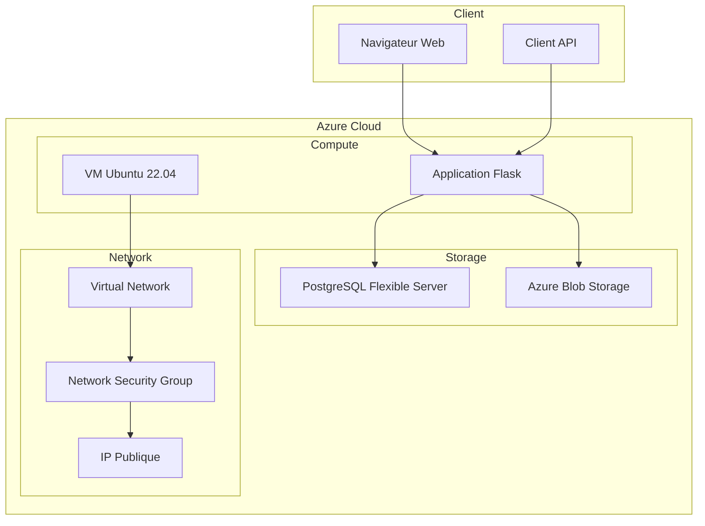

# 📚 Documentation Technique - TodoList Cloud

## 🏗️ Architecture Technique

### Vue d'ensemble du système



### Stack Technologique

| Composant | Technologie | Version | Rôle |
|-----------|-------------|---------|------|
| **Frontend** | HTML5/CSS3/JavaScript | - | Interface utilisateur |
| **Backend** | Python Flask | 2.3.3 | API REST et logique métier |
| **Base de données** | PostgreSQL | 15 | Stockage des données |
| **Cloud Storage** | Azure Blob Storage | - | Stockage de fichiers |
| **Infrastructure** | Terraform | 1.5+ | Infrastructure as Code |
| **Configuration** | Ansible | 2.14+ | Configuration Management |
| **OS** | Ubuntu | 22.04 LTS | Système d'exploitation |

---

## 🗄️ Modèle de Données

### Schéma de Base de Données

```sql
-- Catégories des tâches
CREATE TABLE categories (
    id SERIAL PRIMARY KEY,
    name VARCHAR(50) NOT NULL UNIQUE,
    color VARCHAR(7) NOT NULL,
    description TEXT,
    created_at TIMESTAMP DEFAULT CURRENT_TIMESTAMP
);

-- Tâches principales
CREATE TABLE tasks (
    id SERIAL PRIMARY KEY,
    title VARCHAR(200) NOT NULL,
    description TEXT,
    category_id INTEGER REFERENCES categories(id),
    priority VARCHAR(20) DEFAULT 'medium',
    status VARCHAR(20) DEFAULT 'pending',
    due_date DATE,
    created_at TIMESTAMP DEFAULT CURRENT_TIMESTAMP,
    updated_at TIMESTAMP DEFAULT CURRENT_TIMESTAMP,
    completed_at TIMESTAMP NULL
);

-- Fichiers attachés (extension future)
CREATE TABLE task_files (
    id SERIAL PRIMARY KEY,
    task_id INTEGER REFERENCES tasks(id) ON DELETE CASCADE,
    filename VARCHAR(255) NOT NULL,
    file_path TEXT,
    file_size INTEGER,
    mime_type VARCHAR(100),
    uploaded_at TIMESTAMP DEFAULT CURRENT_TIMESTAMP
);
```

### Relations

- **categories** ← **tasks** (1:N)
- **tasks** ← **task_files** (1:N)

### Contraintes

- `priority`: `['low', 'medium', 'high']`
- `status`: `['pending', 'in_progress', 'completed']`
- `color`: Format hexadécimal (#RRGGBB)

---

## 🔌 API REST

### Endpoints Principaux

#### Tâches

```http
# Lister toutes les tâches
GET /api/tasks
Response: [
  {
    "id": 1,
    "title": "Exemple de tâche",
    "description": "Description détaillée",
    "category": "Travail",
    "priority": "high",
    "status": "pending",
    "due_date": "2024-01-15",
    "created_at": "2024-01-01T10:00:00Z"
  }
]

# Créer une nouvelle tâche
POST /tasks
Content-Type: application/x-www-form-urlencoded
Body: title=Nouvelle+tâche&description=Description&category_id=1&priority=medium&due_date=2024-01-20

# Commencer une tâche
POST /tasks/{id}/start
Response: {"success": true, "message": "Tâche commencée"}

# Terminer une tâche
POST /tasks/{id}/complete
Response: {"success": true, "message": "Tâche terminée"}

# Supprimer une tâche
POST /tasks/{id}/delete
Response: {"success": true, "message": "Tâche supprimée"}
```

#### Catégories

```http
# Lister toutes les catégories
GET /api/categories
Response: [
  {
    "id": 1,
    "name": "Personnel",
    "color": "#4CAF50",
    "description": "Tâches personnelles"
  }
]
```

#### Système

```http
# Vérification de santé
GET /health
Response: {
  "status": "healthy",
  "database": "connected",
  "storage": "connected",
  "timestamp": "2024-01-01T10:00:00Z"
}

# Test du stockage Azure
POST /test-storage
Response: {
  "success": true,
  "message": "Connexion Azure Storage réussie",
  "container": "staticfiles"
}
```

---

## 🏗️ Infrastructure Terraform

### Ressources Créées

```hcl
# Groupe de ressources
resource "azurerm_resource_group" "main" {
  name     = "rg-${var.project_name}-${var.environment}"
  location = var.location
}

# Réseau virtuel
resource "azurerm_virtual_network" "main" {
  name                = "vnet-${var.project_name}-${var.environment}"
  address_space       = ["10.0.0.0/16"]
  location            = azurerm_resource_group.main.location
  resource_group_name = azurerm_resource_group.main.name
}

# Machine virtuelle
resource "azurerm_linux_virtual_machine" "main" {
  name                = "vm-${var.project_name}-${var.environment}"
  resource_group_name = azurerm_resource_group.main.name
  location            = azurerm_resource_group.main.location
  size                = var.vm_size
  
  # Configuration SSH
  admin_username                  = var.admin_username
  disable_password_authentication = true
  
  admin_ssh_key {
    username   = var.admin_username
    public_key = file("~/.ssh/id_rsa.pub")
  }
}

# Base de données PostgreSQL
resource "azurerm_postgresql_flexible_server" "main" {
  name                   = "psql-${var.project_name}-${var.environment}"
  resource_group_name    = azurerm_resource_group.main.name
  location              = azurerm_resource_group.main.location
  version               = "15"
  
  administrator_login    = var.db_admin_username
  administrator_password = var.db_admin_password
  
  sku_name = "B_Standard_B1ms"
  storage_mb = 32768
}

# Stockage Azure
resource "azurerm_storage_account" "main" {
  name                     = "st${var.project_name}${var.environment}"
  resource_group_name      = azurerm_resource_group.main.name
  location                = azurerm_resource_group.main.location
  account_tier            = var.storage_account_tier
  account_replication_type = var.storage_replication
}
```

### Variables Configurables

| Variable | Type | Défaut | Description |
|----------|------|--------|-------------|
| `resource_group_name` | string | - | Nom du groupe de ressources |
| `location` | string | "West Europe" | Région Azure |
| `project_name` | string | "todolist" | Nom du projet |
| `environment` | string | "prod" | Environnement (dev/staging/prod) |
| `vm_size` | string | "Standard_B1s" | Taille de la VM |
| `db_admin_username` | string | - | Utilisateur admin PostgreSQL |
| `db_admin_password` | string | - | Mot de passe admin PostgreSQL |

---

## ⚙️ Configuration Ansible

### Structure du Playbook

```yaml
---
- name: Deploy TodoList Application
  hosts: webservers
  become: yes
  vars:
    app_dir: "/home/{{ ansible_user }}/app"
    python_version: "3.10"
  
  tasks:
    # Installation des dépendances système
    - name: Install system packages
      apt:
        name:
          - python3
          - python3-pip
          - postgresql-client
          - git
        state: present
        update_cache: yes
    
    # Configuration de l'application
    - name: Create application directory
      file:
        path: "{{ app_dir }}"
        state: directory
        owner: "{{ ansible_user }}"
        group: "{{ ansible_user }}"
    
    # Déploiement du code
    - name: Copy application files
      copy:
        src: "{{ item }}"
        dest: "{{ app_dir }}/"
        owner: "{{ ansible_user }}"
        group: "{{ ansible_user }}"
      with_items:
        - app.py
        - requirements.txt
        - sample_data.sql
    
    # Installation des dépendances Python
    - name: Install Python dependencies
      pip:
        requirements: "{{ app_dir }}/requirements.txt"
        executable: pip3
    
    # Configuration de l'environnement
    - name: Create environment file
      template:
        src: env.j2
        dest: "{{ app_dir }}/.env"
        mode: '0600'
        owner: "{{ ansible_user }}"
        group: "{{ ansible_user }}"
    
    # Configuration du firewall
    - name: Configure UFW firewall
      ufw:
        rule: allow
        port: '5000'
        proto: tcp
    
    # Démarrage de l'application
    - name: Start Flask application
      shell: |
        cd {{ app_dir }}
        nohup python3 app.py > app.log 2>&1 &
      become_user: "{{ ansible_user }}"
```

### Templates Ansible

#### Template `.env` (`templates/env.j2`)

```jinja2
# Configuration générée automatiquement par Ansible
DB_HOST={{ hostvars['localhost']['db_server_fqdn'] }}
DB_NAME={{ db_name }}
DB_USER={{ db_admin_username }}
DB_PASS={{ db_admin_password }}

STORAGE_ACCOUNT_NAME={{ hostvars['localhost']['storage_account_name'] }}
STORAGE_ACCOUNT_KEY={{ hostvars['localhost']['storage_account_key'] }}
CONTAINER_NAME=staticfiles

FLASK_ENV=production
FLASK_DEBUG=False
SECRET_KEY={{ ansible_date_time.epoch | hash('sha256') }}
```

---

## 🔧 Configuration de l'Application Flask

### Structure du Code

```python
# app.py - Structure principale
from flask import Flask, render_template, request, jsonify, redirect, url_for
import psycopg2
from azure.storage.blob import BlobServiceClient
import os
from dotenv import load_dotenv

# Chargement de la configuration
load_dotenv()

app = Flask(__name__)
app.secret_key = os.getenv('SECRET_KEY', 'dev-secret-key')

# Configuration de la base de données
DATABASE_CONFIG = {
    'host': os.getenv('DB_HOST'),
    'database': os.getenv('DB_NAME'),
    'user': os.getenv('DB_USER'),
    'password': os.getenv('DB_PASS'),
    'port': 5432,
    'sslmode': 'require'
}

# Configuration Azure Storage
STORAGE_CONFIG = {
    'account_name': os.getenv('STORAGE_ACCOUNT_NAME'),
    'account_key': os.getenv('STORAGE_ACCOUNT_KEY'),
    'container_name': os.getenv('CONTAINER_NAME', 'staticfiles')
}
```

### Gestion des Connexions

```python
def get_db_connection():
    """Établit une connexion à la base de données PostgreSQL"""
    try:
        conn = psycopg2.connect(**DATABASE_CONFIG)
        return conn
    except psycopg2.Error as e:
        print(f"Erreur de connexion à la base de données: {e}")
        return None

def get_blob_service_client():
    """Crée un client pour Azure Blob Storage"""
    try:
        account_url = f"https://{STORAGE_CONFIG['account_name']}.blob.core.windows.net"
        blob_service_client = BlobServiceClient(
            account_url=account_url,
            credential=STORAGE_CONFIG['account_key']
        )
        return blob_service_client
    except Exception as e:
        print(f"Erreur de connexion au stockage Azure: {e}")
        return None
```

### Gestion des Erreurs

```python
@app.errorhandler(404)
def not_found_error(error):
    return jsonify({'error': 'Ressource non trouvée'}), 404

@app.errorhandler(500)
def internal_error(error):
    return jsonify({'error': 'Erreur interne du serveur'}), 500

@app.errorhandler(Exception)
def handle_exception(e):
    app.logger.error(f"Erreur non gérée: {str(e)}")
    return jsonify({'error': 'Une erreur inattendue s\'est produite'}), 500
```

---

## 🎨 Interface Utilisateur

### Technologies Frontend

- **HTML5** : Structure sémantique
- **CSS3** : Styles modernes avec Flexbox/Grid
- **JavaScript Vanilla** : Interactions dynamiques
- **Responsive Design** : Compatible mobile/desktop

### Composants CSS

```css
/* Variables CSS pour la cohérence */
:root {
    --primary-color: #2196F3;
    --secondary-color: #4CAF50;
    --danger-color: #F44336;
    --warning-color: #FF9800;
    --background-gradient: linear-gradient(135deg, #667eea 0%, #764ba2 100%);
    --card-shadow: 0 4px 6px rgba(0, 0, 0, 0.1);
    --border-radius: 8px;
    --transition: all 0.3s ease;
}

/* Composants réutilisables */
.card {
    background: white;
    border-radius: var(--border-radius);
    box-shadow: var(--card-shadow);
    padding: 1.5rem;
    margin-bottom: 1rem;
    transition: var(--transition);
}

.btn {
    padding: 0.5rem 1rem;
    border: none;
    border-radius: var(--border-radius);
    cursor: pointer;
    transition: var(--transition);
    font-weight: 500;
}

.btn-primary {
    background-color: var(--primary-color);
    color: white;
}

.btn-primary:hover {
    background-color: #1976D2;
    transform: translateY(-2px);
}
```

### Interactions JavaScript

```javascript
// Gestion des filtres de tâches
function filterTasks(status) {
    const tasks = document.querySelectorAll('.task-item');
    tasks.forEach(task => {
        if (status === 'all' || task.dataset.status === status) {
            task.style.display = 'block';
        } else {
            task.style.display = 'none';
        }
    });
    
    // Mise à jour des boutons de filtre
    document.querySelectorAll('.filter-btn').forEach(btn => {
        btn.classList.remove('active');
    });
    document.querySelector(`[data-filter="${status}"]`).classList.add('active');
}

// Actions sur les tâches
function performTaskAction(taskId, action) {
    fetch(`/tasks/${taskId}/${action}`, {
        method: 'POST',
        headers: {
            'Content-Type': 'application/json',
        }
    })
    .then(response => response.json())
    .then(data => {
        if (data.success) {
            location.reload();
        } else {
            alert('Erreur: ' + data.message);
        }
    })
    .catch(error => {
        console.error('Erreur:', error);
        alert('Une erreur est survenue');
    });
}
```

---

## 🔒 Sécurité

### Mesures Implémentées

1. **Authentification SSH** : Clés publiques/privées uniquement
2. **Firewall UFW** : Ports 22 (SSH) et 5000 (Flask) uniquement
3. **SSL/TLS** : Connexions chiffrées vers PostgreSQL
4. **Variables d'environnement** : Secrets non exposés dans le code
5. **Validation des entrées** : Sanitisation des données utilisateur
6. **Gestion d'erreurs** : Pas d'exposition d'informations sensibles

### Recommandations Additionnelles

```python
# Validation des entrées
from flask_wtf import FlaskForm
from wtforms import StringField, TextAreaField, SelectField, DateField
from wtforms.validators import DataRequired, Length, Optional

class TaskForm(FlaskForm):
    title = StringField('Titre', validators=[
        DataRequired(message='Le titre est requis'),
        Length(min=1, max=200, message='Le titre doit faire entre 1 et 200 caractères')
    ])
    description = TextAreaField('Description', validators=[
        Optional(),
        Length(max=1000, message='La description ne peut pas dépasser 1000 caractères')
    ])
    priority = SelectField('Priorité', choices=[
        ('low', 'Faible'),
        ('medium', 'Moyenne'),
        ('high', 'Élevée')
    ])
```

---

## 📊 Monitoring et Logs

### Logs de l'Application

```python
import logging
from logging.handlers import RotatingFileHandler

# Configuration des logs
if not app.debug:
    file_handler = RotatingFileHandler('logs/todolist.log', maxBytes=10240, backupCount=10)
    file_handler.setFormatter(logging.Formatter(
        '%(asctime)s %(levelname)s: %(message)s [in %(pathname)s:%(lineno)d]'
    ))
    file_handler.setLevel(logging.INFO)
    app.logger.addHandler(file_handler)
    app.logger.setLevel(logging.INFO)
    app.logger.info('TodoList application startup')
```

### Métriques de Performance

```python
import time
from functools import wraps

def monitor_performance(f):
    @wraps(f)
    def decorated_function(*args, **kwargs):
        start_time = time.time()
        result = f(*args, **kwargs)
        end_time = time.time()
        
        app.logger.info(f"Function {f.__name__} took {end_time - start_time:.2f} seconds")
        return result
    return decorated_function

@app.route('/api/tasks')
@monitor_performance
def get_tasks():
    # Logique de récupération des tâches
    pass
```

---

## 🔧 Maintenance et Troubleshooting

### Commandes Utiles

```bash
# Vérification de l'état des services
sudo systemctl status todolist
sudo journalctl -u todolist -f

# Monitoring des ressources
htop
df -h
free -h

# Logs de l'application
tail -f /home/azureuser/app/app.log
tail -f /var/log/syslog

# Base de données
psql -h $DB_HOST -U $DB_USER -d $DB_NAME
\dt  # Lister les tables
\d tasks  # Décrire la table tasks

# Stockage Azure
az storage blob list --account-name $STORAGE_ACCOUNT_NAME --container-name staticfiles
```

### Problèmes Courants

| Problème | Symptôme | Solution |
|----------|----------|----------|
| App inaccessible | Timeout de connexion | Vérifier UFW et NSG Azure |
| Erreur DB | 500 Internal Server Error | Vérifier les credentials et SSL |
| Stockage Azure | Erreur upload | Vérifier les clés d'accès |
| Performance lente | Réponses lentes | Optimiser les requêtes SQL |

---

**Cette documentation technique fournit tous les détails nécessaires pour comprendre, maintenir et étendre l'application TodoList Cloud.**
